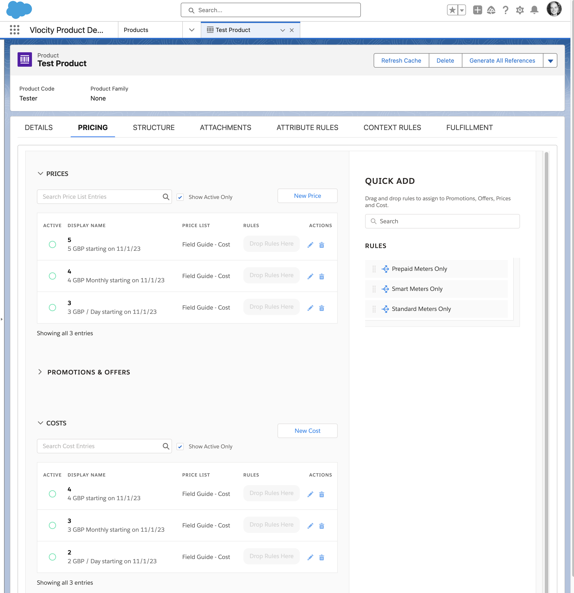

## Initial Setup

Starting point is the [official documentation](https://help.salesforce.com/s/articleView?id=ind.comms_cost_and_margin_in_epc.htm&type=5). Follow the steps to configure Cost and Margin.

### Enable Cost and Margin

Before enabling Cost and Margin navigate to *Vlocity Pricing Designer > Pricing Variables > List View: All*.

Notice that there **are not** Cost / Margin Pricing Variables. 

Navigate to *Setup > Object Manager > Order Product > Fields & Relationships*.

Notice that there **are** Cost / Margin Fields.

When you Enable Cost and Margin, the Pricing Variables are created that connect CPQ to the relevant fields across xLI and Asset.

This is an imoprtant consideration as it helps define the pattern required when adding custom fields (you will need to create the fields and Pricing Variables required). At this stage a hook is required to cover the calculation logic that is proved out of the box for One Time Charge, Monthly Recurring Charges and Usage Pricing.

#### Enable Cost and Margin Feature as per the [docs](https://help.salesforce.com/s/articleView?language=en_US&id=ind.comms_enabling_cost_and_margin.htm&type=5).

Navigate back to *Vlocity Pricing Designer > Pricing Variables > List View: All*.

Notice that there **are** Cost / Margin Pricing Variables now.

Navigate to *Vlocity Product Designer > Products > List View: All Products*. Open the Boiler Insurance Product and navigate to the Pricing tab.

#### Create a Price List Entry under Costs by click on *New Cost*.

- Price List: This should be the same list price as the Price defined for your product. If you have multiple price lists and for a single products
- Display Name: Required but used in any UI components. Usually set to the same value as the Amount.
- Virtual Price: Not used in Costs. In the UI by default based on being used for Prices in the old Angular Cart.
- Type: Cannot change in UI
- Amount: Cost amount. Costs are expected to be immutable so there once costs are defined as PLE or through ABP there are no options to make adjustments in the UI.
- Currency: Should be the same as the price.
- Recurring Frequency: Should be the same as the corresponding price.
- Start Date: Point from which cost is valid. 
- End Date: Popint at which cost is no longer value (can be NULL).

Notes on Cost PLEs:

If using PLEs for costs they are considered fixed. If you need some dynamic logic in how costs are calculated you should use ABP to build up the cost dynamically (for example, based on attribute values). [This topic is covered in calculating costs using matrices](/docs/pages/2-costs-matrices.md).

#### LWC Cart

Navigate to Industries CPQ > Orders > List View: All